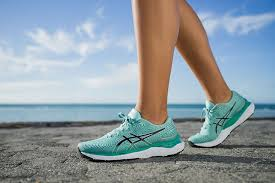

# KingShop
Мій магазин
<html lang="uk">
<head>
    <meta charset="UTF-8">
    <meta name="viewport" content="width=device-width, initial-scale=1.0">
    <title>Магазин спортивного взуття</title>
    
</head>
<body>

    <header>
        <h1>Магазин спортивного взуття</h1>
    </header>

    <nav>
        <a href="#running">Бігове взуття</a>
        <a href="#basketball">Баскетбольне взуття</a>
        <a href="#training">Тренувальне взуття</a>
    </nav>

    <section id="running">
        <h2>Бігове взуття</h2>
        <article>
            
            
Це бігове взуття створене для максимального комфорту та підтримки під час тривалих бігів. З використанням інноваційних технологій, це взуття пропонує ідеальну амортизацію та забезпечує неймовірний зчеплення з поверхнею.

            <a href="#" class="show-more">Дізнатися більше</a>
            

                
Додаткова інформація: Це взуття оснащене вентиляційною технологією для забезпечення оптимальної циркуляції повітря під час бігу. Воно також має підтримуючу підошву для запобігання втомі ніг під час тривалого тренування.

            

        </article>

        <article>
            
            
Це взуття для трейл-бігу призначене для тих, хто любить виклик та пригоди на непередбачуваних маршрутах. З водонепроникним верхом та підсиленою підошвою, воно готове до подолання будь-яких перешкод у вашому шляху.

            <a href="#" class="show-more">Дізнатися більше</a>
            

                
Додаткова інформація: Це взуття має антискользкі властивості та додатковий захист від вологи. Воно ідеально підходить для тренувань в гірських районах та допомагає зберегти ваші ноги сухими та безпечними.

            

        </article>
        <!-- Додайте більше інформації про інші види бігового взуття -->
    </section>

    <section id="basketball">
        <h2>Баскетбольне взуття</h2>
        <article>
            
            
Це баскетбольне взуття розроблене для гравців, які шукають оптимальну комбінацію підтримки та гнучкості на баскетбольному майданчику. З високим верхом для додаткової стабільності під час стрибків та оборони.

            <a href="#" class="show-more">Дізнатися більше</a>
            

                
Додаткова інформація: Це взуття оснащене спеціальною амортизаційною системою для зменшення навантаження на суглоби під час інтенсивної гри. Також воно має покриття, що запобігає ковзанню на паркеті.

            

        </article>

        <article>
            
            
Це баскетбольне взуття з високим верхом призначене для тих, хто шукає додаткову підтримку гомілкового суглоба та щиколотки. З використанням технологій, які забезпечують стабільність та захист від травм.

            <a href="#" class="show-more">Дізнатися більше</a>
            

                
Додаткова інформація: Це взуття забезпечує ефективну фіксацію гомілкового суглоба та має вбудовану амортизаційну систему. Воно призначене для гравців, які цінують безпеку та високий рівень комфорту.

            

        </article>
        <!-- Додайте більше інформації про інші види баскетбольного взуття -->
    </section>

    <section id="training">
        <h2>Тренувальне взуття</h2>
        <article>
            
            
Це тренувальне взуття ідеально підходить для різних видів тренувань, включаючи фітнес, кросфіт та силові тренування. Воно поєднує в собі зручність та стиль, забезпечуючи оптимальну продуктивність під час тренувань.

            <a href="#" class="show-more">Дізнатися більше</a>
            

                
Додаткова інформація: Це взуття має спеціальну підошву для забезпечення хорошого зчеплення з поверхнею тренажерного залу. Воно також має амортизаційні властивості для захисту ваших суглобів від навантажень.

            

        </article>

        <article>
            
            
Це взуття спеціально розроблене для екстремальних тренувань у стилі кросфіту. З високою стійкістю та вентиляційними властивостями, воно готове викликати будь-які виклики, які може поставити перед вами тренер.

            <a href="#" class="show-more">Дізнатися більше</a>
            

                
Додаткова інформація: Це взуття володіє підвищеною міцністю та витривалістю для відповіді на інтенсивні тренування. Воно також має спеціальні вставки для підтримки стопи та запобігання травмам.

            

        </article>
        <!-- Додайте більше інформації про інші види тренувального взуття -->
    </section>

    <footer>
        
&copy; 2024 Магазин спортивного взуття. Всі права захищені.

    </footer>

    

</body>
</html>
